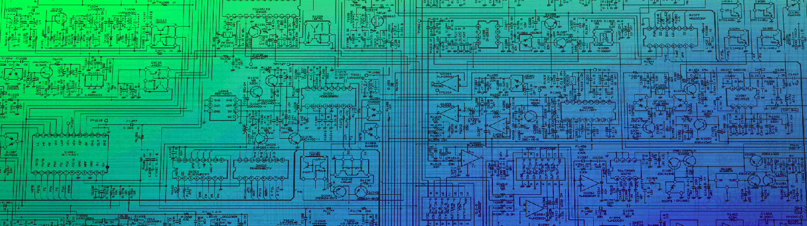
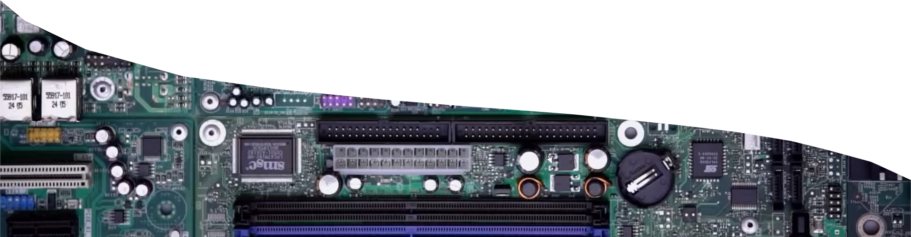

### Hello   

I am Manikandan Nair, a graduate in Electronics & Communication Engineering. I like to write simple scripts that automate daily mundane tasks. I am more inclined and passionate towards hardware although most of my repositories here might lead you to think otherwise.
I also try my best to contribute to open source projects and encourage their use.

 

  You seem to be visitor #
  

  

 
 

